<p align="center">
  <picture>
    <source media="(prefers-color-scheme: dark)" srcset="assets/banner-dark.svg">
    <source media="(prefers-color-scheme: light)" srcset="assets/banner-light.svg">
    
  </picture>
</p>

<p align="center">
  <a href="https://github.com/Baylox/sentinel-py/actions/workflows/ci.yml"></a>
  
  
  
  
</p>

---

SentinelPy is a modular network reconnaissance tool written in Python. It probes a host over a range of ports and reports what is listening, what web server answers, and whether the TLS certificate is still valid.

It is a reconnaissance tool, not a vulnerability scanner: it does not maintain a CVE database and it does not attempt exploitation. It tells you what is exposed, and leaves the interpretation to you.

## Modules

<p align="center">
  
</p>

Modules are selected with `--modules` and can be combined. Each one returns its own result structure.

| Module | What it does | Fields returned per port |
| --- | --- | --- |
| `tcp` | Resolves the host, then opens TCP connections across the port range | `port`, `status`, `service`, `error` |
| `http` | Sends a GET request to every port in the range and reads the response headers | `port`, `status`, `status_code`, `server`, `content_type`, `url` |
| `ssl` | Performs a single TLS handshake and inspects the presented certificate | `ok`, `issued_to`, `issued_by`, `valid_from`, `valid_until`, `days_left`, `expired`, `error` |

The `tcp` module names the service behind each open port using the system service table. The `http` module recognises Apache, Nginx, Microsoft IIS, Lighttpd, Gunicorn and Caddy from the `Server` header, and falls back to the raw header value otherwise. The `ssl` module scans one port only, set by `--ssl-port`, not the whole range.

## Installation

Install from source. Python 3.8 or later is required.

```bash
git clone https://github.com/Baylox/sentinel-py.git
```

Then, from the project directory:

```bash
pip install -e .
```

To include the development tools:

```bash
pip install -e ".[dev]"
```

## Usage

The command takes a host and a port range, in that order:

```bash
sentinelpy <host> <start-end> [options]
```

A TCP scan, which is the default module:

```bash
sentinelpy example.com 20-80
```

Several modules in a single run:

```bash
sentinelpy example.com 20-443 --modules tcp http ssl
```

A certificate check on its own:

```bash
sentinelpy example.com 443-443 --modules ssl
```

Exporting the results:

```bash
sentinelpy example.com 20-80 --json results.json --csv results.csv
```

Without installing the package, `main.py` is an equivalent entry point:

```bash
python main.py example.com 20-80
```

## Python API

The package is usable as a library. `scan_ports` wraps the TCP scanner for the common case:

```python
from scanner import scan_ports

results = scan_ports("example.com", "20-80", timeout=0.5)
print(results["open_ports"])
```

For finer control, build a `ScanConfig` and call a scanner directly. This is the same path the CLI takes, so every option described below is available:

```python
from scanner import TCPScanner
from scanner.core.config import ScanConfig
from scanner.utils.rate_limiter import RateLimiter

config = ScanConfig(
    host="example.com",
    ports=(20, 443),
    timeout=0.5,
    workers=200,
    rate_limiter=RateLimiter.from_preset("stealth"),
)

results = TCPScanner().scan(config)
```

Failures raise `PortScannerError`, or its subclasses `PortRangeError` and `HostResolutionError`.

## Concurrency

The TCP scanner connects to ports through a thread pool, so the per-port timeouts overlap instead of accumulating. This matters most on filtered hosts, where every closed port would otherwise cost a full timeout in sequence. Results are reassembled in ascending port order, so output stays deterministic regardless of completion order.

```bash
sentinelpy example.com 1-1000 --workers 200
```

```bash
sentinelpy example.com 1-1000 --workers 1
```

The worker count is capped at the number of ports being scanned, so a narrow range never spawns idle threads. Rate limiting still applies: dispatch is paced on the submitting thread, which keeps the global request rate bounded even while connections overlap.

## Options

**Required arguments**

| Argument | Description |
| --- | --- |
| `host` | Target IP address or domain name |
| `ports` | Port range, written `start-end`, for example `20-80` |

**Module selection**

| Option | Default | Description |
| --- | --- | --- |
| `--modules` | `tcp` | One or more of `tcp`, `http`, `ssl` |

**Scan options**

| Option | Default | Description |
| --- | --- | --- |
| `-t`, `--timeout` | `0.5` | Timeout per request, in seconds, between 0.1 and 10.0 |
| `--workers` | `100` | Concurrent connections for the TCP scan, between 1 and 1000 |
| `--ssl-port` | `443` | Port used by the `ssl` module |
| `--no-verify` | off | Disable certificate verification during the TLS handshake |

**Output options**

| Option | Default | Description |
| --- | --- | --- |
| `--json FILENAME` | none | Write the results to a JSON file |
| `--csv FILENAME` | none | Write the results to a CSV file |
| `--print-json` | off | Print the results as JSON on stdout |

**Rate limiting options**

| Option | Default | Description |
| --- | --- | --- |
| `--preset` | `normal` | One of `stealth`, `normal`, `aggressive`, `none` |
| `--delay` | none | Fixed delay between requests in seconds, overrides `--preset` |

**Logging options**

| Option | Default | Description |
| --- | --- | --- |
| `--logfile FILENAME` | `scanner.log` | Write logs to a specific file inside `logs/` |
| `--show-logs` | off | Print the log file after the run |
| `--clear-logs` | off | Empty the `logs/` directory before running |

**Utility and display**

| Option | Description |
| --- | --- |
| `--list-exports` | List the files currently in `exports/` |
| `--clean-exports` | Delete the JSON and CSV files in `exports/` |
| `--verbose` | Show closed ports as well as open ones |

`--list-exports` and `--clean-exports` run on their own, without a host or port range.

## Rate limiting

Every request goes through a rate limiter. This keeps a scan from saturating the target and makes the traffic less conspicuous.

<p align="center">
  
</p>

| Preset | Delay | Approximate rate | Intended for |
| --- | --- | --- | --- |
| `stealth` | 1s, randomised between 0.5x and 2x | 1 req/s | External targets, spread out over time |
| `normal` | 50ms | 20 req/s | The default, a balance of speed and restraint |
| `aggressive` | 10ms | 100 req/s | Internal networks you control |
| `none` | none | unbounded | Local testing only |

The `stealth` preset is the only one that randomises its delay; the others wait a fixed amount.

```bash
sentinelpy example.com 1-1000 --preset stealth
```

```bash
sentinelpy 192.168.1.1 1-1000 --preset aggressive
```

```bash
sentinelpy example.com 1-100 --delay 0.2
```

Two safeguards apply to `none`:

> [!IMPORTANT]
> Choosing `--preset none` writes a warning to the log. Beyond 1000 ports, the `aggressive` preset (10ms) is reinstated automatically, so an unthrottled sweep of a large range cannot be launched by accident.

## Output

Results are grouped by module. A JSON export of a TCP scan looks like this:

```json
{
  "tcp": {
    "open_ports": [22, 80],
    "scan_results": [
      { "port": 22, "status": "open", "service": "ssh", "error": "" },
      { "port": 23, "status": "closed", "service": "", "error": "" },
      { "port": 80, "status": "open", "service": "http", "error": "" }
    ]
  }
}
```

The CSV export flattens every module into one table with the columns `host`, `port`, `status`, `service` and `banner`.

Exports are written to `exports/` and logs to `logs/`. Both directories are created on demand, and a filename that tries to escape them is rejected before anything is written.

## Validation

Arguments are checked before a single packet leaves the machine:

- Ports must fall between 1 and 65535, and the start must not exceed the end.
- The timeout must lie between 0.1 and 10.0 seconds.
- The worker count must lie between 1 and 1000.
- The host must be a syntactically valid IP address or domain name.
- Export and log filenames are confined to `exports/` and `logs/` respectively; path traversal is rejected.
- For the `tcp` module the host is resolved first, so an unresolvable name fails immediately rather than after a full sweep of timeouts.

## Development

Set up an environment and install the development dependencies:

```bash
python -m venv .venv
```

Activate it with `.venv\Scripts\Activate` on Windows or `source .venv/bin/activate` on Linux and macOS, then:

```bash
pip install -e ".[dev]"
```

Install the git hooks, which run isort, black and flake8 on each commit:

```bash
pre-commit install
```

The makefile wraps the usual tasks: `make test`, `make lint`, `make typecheck`, `make security`, `make format`, `make check`, `make coverage` and `make clean`. Override the interpreter with `make PY=python3` if the default does not match your setup.

Running the suite directly:

```bash
pytest
```

```bash
pytest --cov=scanner --cov-report=html
```

```bash
pre-commit run --all-files
```

Every push and pull request runs the [CI workflow](.github/workflows/ci.yml): the test suite across Python 3.8 through 3.13, plus separate lint, type-check and security jobs.

## Architecture

Scanners register themselves against a central registry, so adding a module means writing a class decorated with `@ScannerRegistry.register("name")` and nothing else: the CLI discovers it, and its name becomes a valid value for `--modules` automatically.

The command-line layer parses input and renders output; it holds no scanning logic. Scanners receive a single `ScanConfig` object and return a result model, which keeps them independent of how arguments were supplied.

[docs/ARCHITECTURE.md](docs/ARCHITECTURE.md) goes into more detail.

## Legal notice

> [!WARNING]
> Scan only systems you own or have written permission to test. Unauthorised scanning is illegal in many jurisdictions, and the rate limiter does not change that.

This tool is provided for educational use and for authorised security testing. It is released under the [MIT License](LICENSE), and the author accepts no responsibility for misuse.
